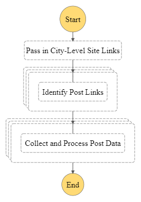

# Supplemental Code for "Digital Formation Processes: A High-Frequency, Large-Scale Investigation"

The code and data in this repository can be used to reproduce the data collection and analysis from Clindaniel and Magnani (Under Review) "Digital Formation Processes: A High-Frequency, Large-Scale Investigation." Consult the information below as a guide to navigating the repository.

## Table of Contents

- [Data Collection Pipeline](#data-collection-pipeline)
    - [Overview](#overview)
    - [Gathering City-specific Page Links](#gathering-city-specific-page-links)
    - [Building and Deploying Lambda Functions for Data Collection](#building-and-deploying-lambda-functions-for-data-collection)
- [Data Processing and Analysis](#data-processing-and-analysis)
    - [Data Preprocessing and Preparation](#data-preprocessing-and-preparation)
    - [Data Aggregation and Analysis](#data-aggregation-and-analysis)
    - [Data Visualization](#data-visualization)

## Data Collection Pipeline

### Overview

Standard, serial webscraping approaches were not able to collect all of the Craigslist "Free Stuff" / "Curb Alert" post data at the high-frequency collection intervals this study required (in an early test, one iteration of our data collection pipeline took over 30 hours to complete, but we needed it to finish in less than one hour). Therefore, post data was collected using a parallel web-scraping approach implemented using [AWS Step Functions](https://docs.aws.amazon.com/step-functions/latest/dg/welcome.html). All of the code necessary to replicate this pipeline is available in the [`collection/`](./collection/) directory.

Craigslist pages are indexed by city (e.g. `chicago.craigslist.org`). Therefore, when the Step Functions state machine is invoked, it first takes in a list of city-specific site links, and invokes a Lambda worker to collect data from each link in parallel (each running the Lambda function code in the [`post_link_identifier/`](./collection/post_link_identifier/) subdirectory of the [`collection/`](./collection/) directory). This first set of Lambda workers concurrently collects all of the individual post links available on each city-specific Craigslist page and stores the intermediate data in an AWS S3 bucket. Once all of these post links are collected, a second set of up to 1,000 Lambda workers (running the Lambda function code in the [`post_batch_processor/`](./collection/post_batch_processor/) subdirectory of the [`collection/`](./collection/) directory) collects all of the data from the posts identified by the first set of Lambda workers in parallel and stores all collected post data in an S3 bucket for further analysis. This state machine was automatically triggered every hour using AWS' EventBridge Scheduler (collecting whatever data was accessible at that time). When the state machine is triggered, it takes approximately 7 minutes to finish running the full data collection pipeline (allocating 3 GB of RAM to the Lambda functions).

Visually, the pipeline does the following:



The exact Step Function definition can be examined in [`definition.asl.json`](./collection/step_function/definition.asl.json) in the [`step_function/`](./collection/step_function/) subdirectory of the [`collection/`](./collection/) directory. Instructions for generating the list of city-specific page links passed to the first set of Lambda workers, as well as deploying the Lambda functions referenced in the Step Function definition are below.

### Gathering City-specific Page Links

As mentioned in the overview, Craigslist pages are indexed by location (e.g. `chicago.craigslist.org`). Here, we collect data from the 23 cities listed by Craigslist as the top "us cities" -- which can be replicated programmatically via `requests` and `BeautifulSoup` in Python like so:

```python
import requests
from bs4 import BeautifulSoup

# Start on a local Craigslist page
r = requests.get('https://chicago.craigslist.org/')
soup = BeautifulSoup(r.text)

# Collect list of links to city-specific Craigslist pages
a_cities = [i for i in soup.find_all('h5', class_='ban')
              if i.text == 'us cities'][0].find_next() \
                                          .find_all('a')[:-1] # drop the "more" link

# Only gather posts from the "Free Stuff" category -- labeled `zip`
city_links = [a.get('href') + '/search/zip' for a in a_cities]
city_links
```

Running the above script results in the list of city-specific URLs that we gather data from (note that these are the same city links that are passed in parallel to the first set of Lambda workers in `step_function/definition.asl.json`):

```bash
['http://atlanta.craigslist.org/search/zip',
 'http://austin.craigslist.org/search/zip',
 'http://boston.craigslist.org/search/zip',
 'http://chicago.craigslist.org/search/zip',
 'http://dallas.craigslist.org/search/zip',
 'http://denver.craigslist.org/search/zip',
 'http://detroit.craigslist.org/search/zip',
 'http://houston.craigslist.org/search/zip',
 'http://lasvegas.craigslist.org/search/zip',
 'http://losangeles.craigslist.org/search/zip',
 'http://miami.craigslist.org/search/zip',
 'http://minneapolis.craigslist.org/search/zip',
 'http://newyork.craigslist.org/search/zip',
 'http://orangecounty.craigslist.org/search/zip',
 'http://philadelphia.craigslist.org/search/zip',
 'http://phoenix.craigslist.org/search/zip',
 'http://portland.craigslist.org/search/zip',
 'http://raleigh.craigslist.org/search/zip',
 'http://sacramento.craigslist.org/search/zip',
 'http://sandiego.craigslist.org/search/zip',
 'http://seattle.craigslist.org/search/zip',
 'http://sfbay.craigslist.org/search/zip',
 'http://washingtondc.craigslist.org/search/zip']
```

### Building and Deploying Lambda Functions for Data Collection

The only way to deploy the Lambda functions used for data collection (due to the size of their dependencies) is to create a Docker image of the code, upload it to an AWS ECR (Elastic Container Registry) repository, and then use that image to create a Lambda function [as per the AWS Documentation](https://docs.aws.amazon.com/lambda/latest/dg/images-create.html). This also makes it possible to debug locally using the same setup as in the Lambda environment (by using a Lambda Python 3.9 base image). 

As an example of this workflow, we can build and deploy the image for the Lambda function in the [`post_link_identifier`](./collection/post_link_identifier/) directory in a terminal window like so (swapping out `post_link_identifier` with `post_batch_processor` in the instructions below to do the same thing for the second Lambda function):

1. Build Docker Image with Selenium and Chromedriver installed and tag it with a recognizable name (here, the same name as the directory `post_link_identifier`; note that this command assumes your working directory is the [`collection/`](./collection/) directory):
    ```
    docker build ./post_link_identifier/ -t post_link_identifier
    ```

2. The image we have created maps onto Python 3.9 AWS Lambda Function, so we can debug in this environment as if we were working directly with an AWS Lambda function using `docker run`:
    ```
    docker run -p 9000:8080 post_link_identifier:latest
    ```
    
    After running the above command, we can debug the function locally by passing in test data after the `-d` flag (using the standard Lambda Invocation endpoint and a string key/value input payload):
    
    ```
    curl -XPOST "http://localhost:9000/2015-03-31/functions/function/invocations" -d '{"city_links": ["https://atlanta.craigslist.org/search/zip"]}'
    ```

3. Authenticate Docker with the AWS CLI (see linked in instructions above; jwe ust swap out the number `000000000000` with our AWS user number in all of the below, along with name of our repository/image -- here, assumed to be `post_link_identifier`):
    ```
    aws ecr get-login-password --region us-east-1 | docker login --username AWS --password-stdin 000000000000.dkr.ecr.us-east-1.amazonaws.com
    ```
4. Create AWS ECR repository with a unique name
    ```
    aws ecr create-repository --repository-name post_link_identifier --image-scanning-configuration scanOnPush=true --image-tag-mutability MUTABLE
    ```

5. Tag Docker image to match repository name and deploy to ECR using `docker push`
    ```
    docker tag post_link_identifier:latest 000000000000.dkr.ecr.us-east-1.amazonaws.com/post_link_identifier:latest
    docker push 000000000000.dkr.ecr.us-east-1.amazonaws.com/post_link_identifier:latest
    ```

6. Finally, we [create a Lambda function](https://docs.aws.amazon.com/lambda/latest/dg/gettingstarted-images.html#configuration-images-create) via our container image URI, increasing the timeout for the Lambda function to 10 minutes so that it does not timeout before it is finished collecting data. Note that the `FunctionName` fields in [`definition.asl.json`](./collection/step_function/definition.asl.json) are specific to the Amazon Resource Name (ARN) of our Lambda function, so, if we were running this on a separate AWS account, we would need to change these entries to match the ARNs corresponding to the Lambda functions in the other account in order for the Step Function to operate properly.

### Setting up the Step Functions State Machine

Once the Lambda functions are active, we can create a Step Function state machine based on [`definition.asl.json`](./collection/step_function/definition.asl.json) (swapping out the Lambda Function ARNs, as necessary to match the ARNs for the Lambda Functions created in our account), [which is written in Amazon States Language (ASL)](https://docs.aws.amazon.com/step-functions/latest/dg/concepts-amazon-states-language.html) -- AWS' language for defining state machines. 

Once the state machine has been successfully created, we can either manually invoke the entire data collection pipeline or [configure EventBridge Scheduler to trigger it on a schedule](https://docs.aws.amazon.com/eventbridge/latest/userguide/eb-create-rule-schedule.html). For this study (a "high-frequency archaeological survey"), we scheduled the data collection pipeline to be triggered automatically every hour.

## Data Processing and Analysis

### Data Preprocessing and Preparation

Once we had collected data for our study period (February 2023), we using an AWS EMR Cluster and Spark (3.0.1) to preprocess the collected data to enable more efficient analysis. Our preprocessing code is available in the [`data_analysis/`](./data_analysis/) directory in [`00_preprocessing.ipynb`](./data_analysis/00_preprocessing.ipynb).

### Data Aggregation and Analysis

Using this preprocessed data, we then performed the analysis described in the article to identify and interpret digital formation processes on the basis of Craigslist "Free Stuff" / "Curb Alert" posts. We again performed this analytical workflow in Spark on an EMR cluster to enable to scalable performance for this large dataset. 

Over the course of our analysis, we wrote aggregated data to file so that other researchers can replicate the figures in the article, while still preserving the privacy of Craigslist users by not publishing individual post data (which often includes home addresses in the body text, alongside exact longitude/latitude coordinates). This aggregate data is available in the [`data_analysis/data/`](./data_analysis/data/) directory of this repository.

A detailed description and all of the code necessary to replicate our data aggregation and analysis workflow is available in the [`data_analysis/`](./data_analysis/) directory in [`01_analysis.ipynb`](./data_analysis/01_analysis.ipynb).

### Data Visualization

Finally, based on this aggregate data, we generated the figures featured in the article. A detailed description and all of the code necessary to replicate the data visualizations that were used as figures in the article are available in the [`data_analysis/`](./data_analysis/) directory in [`02_visualization.ipynb`](./data_analysis/02_visualization.ipynb). As described in the code, all of the code can be run in a standard Python environment (it doesn't require an AWS EMR cluster).